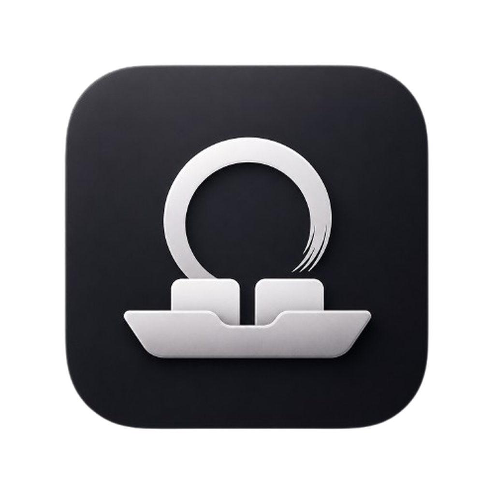

<p align="center">
  
</p>

<h1 align="center">ZenShelf</h1>

<p align="center">
  Menu bar companion for Zen Browser — access your Essentials without leaving your workflow.
</p>

<p align="center">
  
  
  
</p>

---

ZenShelf lives in your menu bar and syncs your Zen Browser Essentials. Click an essential to switch to it instantly — no need to switch windows or hunt through tabs.

## Features

- **Instant access** — your pinned Essentials appear in the menu bar
- **Keyboard shortcuts** — switch to Essentials 1–9 with ⌘1 through ⌘9
- **Auto-sync** — stays up to date as you add or remove Essentials in Zen
- **Favicons** — shows site icons for quick visual recognition
- **Launch at login** — optional, toggle in Preferences
- **Dock icon control** — hide it from the Dock for a pure menu bar experience

## Requirements

- macOS 26.0+
- [Zen Browser](https://zen-browser.app) installed
- Accessibility permission (for keyboard shortcut switching)

## Installation

### Homebrew (recommended)

```bash
brew tap aman-senpai/apps
brew install --cask zenshelf
```

### Manual

1. Download the latest `.zip` from [Releases](https://github.com/aman-senpai/Zenshelf/releases)
2. Unzip and move **ZenShelf** to your Applications folder
3. Open ZenShelf — it appears in the menu bar
4. Grant Accessibility permission when prompted (System Settings → Privacy & Security → Accessibility)

## How It Works

ZenShelf reads Zen Browser's profile data to discover your Essentials. When you click one, it activates Zen and uses ⌘1–⌘9 to switch to that tab. This requires Accessibility permission so ZenShelf can send keyboard events to Zen.

## Building

```bash
git clone git@github.com:aman-senpai/Zenshelf.git
cd Zenshelf
open Zenshelf.xcodeproj
```

Build and run with Xcode (⌘R).

## License

MIT
